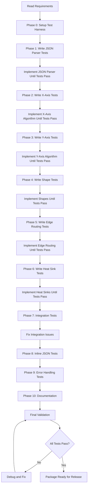

# AGENTS.md: Test-Driven Development Guide for Energese Package

## Overview

This document provides a Test-Driven Development (TDD) framework for implementing the `energese` LaTeX package. It is designed to guide an LLM implementation agent through incremental development with continuous validation.

## Development Philosophy

**Test-First Approach**: Each feature must have failing tests before implementation begins.

**Incremental Complexity**: Start with minimal viable functionality, validate, then extend.

**Continuous Integration**: Every test suite must pass before moving to the next phase.

## Project Structure

```
energese/
├── energese.sty              # Main package file (generated)
├── energese-core.lua         # Core Lua algorithms (generated)
├── energese-shapes.tex       # PGF shape definitions (generated)
├── tests/
│   ├── unit/                 # Unit tests for individual functions
│   ├── integration/          # Integration tests for complete workflows
│   ├── fixtures/             # Test JSON data files
│   └── expected/             # Expected PDF outputs
├── docs/
│   ├── energese_requirements.md  # Requirements specification
│   └── examples/             # Example documents
└── AGENTS.md                 # This file
```

## Phase 0: Test Infrastructure Setup

### Agent Task 0.1: Create Test Harness

**Objective**: Establish the testing framework before any implementation.

**Deliverables**:
1. `tests/run_tests.sh` - Shell script to execute all tests
2. `tests/test_utils.lua` - Helper functions for Lua testing
3. `tests/compare_pdf.sh` - PDF visual comparison utility

**Test Harness Requirements**:

```bash
#!/bin/bash
# tests/run_tests.sh

# Usage: ./run_tests.sh [phase_number]
# Returns: 0 if all tests pass, 1 if any fail

PHASE=${1:-all}
FAILED=0

run_test_suite() {
    local suite=$1
    echo "=========================================="
    echo "Running: $suite"
    echo "=========================================="
    
    if lualatex --interaction=batchmode "$suite.tex" > /dev/null 2>&1; then
        echo "✓ PASS: $suite"
    else
        echo "✗ FAIL: $suite"
        FAILED=1
        cat "${suite}.log" | grep -A 5 "^!"
    fi
}

# Run appropriate test phase
if [ "$PHASE" == "all" ] || [ "$PHASE" == "1" ]; then
    run_test_suite "tests/unit/test_json_parser"
fi

exit $FAILED
```

**Success Criteria**:
- [ ] Test harness runs without errors (even with no tests yet)
- [ ] Can execute individual test suites
- [ ] Reports pass/fail clearly
- [ ] Captures and displays error messages

---

## Phase 1: JSON Parsing and Validation

### Agent Task 1.1: JSON Parser Unit Tests

**Objective**: Validate JSON input parsing before implementing layout logic.

**Test File**: `tests/unit/test_json_parser.tex`

```latex
\documentclass{article}
\usepackage{luacode}
\usepackage{energese}

\begin{document}

\directlua{
    -- Test 1: Valid minimal JSON
    local test1_json = [[
    {
        "nodes": [
            {"id": "A", "type": "source", "Tr": 1, "label": "Test"}
        ],
        "edges": []
    }
    ]]
    
    local result = energese.parse_json(test1_json)
    assert(result ~= nil, "Test 1 Failed: Valid JSON should parse")
    assert(#result.nodes == 1, "Test 1 Failed: Should have 1 node")
    assert(result.nodes[1].id == "A", "Test 1 Failed: Node ID should be 'A'")
    print("✓ Test 1 PASSED: Valid minimal JSON")
    
    -- Test 2: Invalid JSON (missing comma)
    local test2_json = [[
    {
        "nodes": [
            {"id": "A" "type": "source"}
        ]
    }
    ]]
    
    local success = pcall(function() energese.parse_json(test2_json) end)
    assert(not success, "Test 2 Failed: Invalid JSON should raise error")
    print("✓ Test 2 PASSED: Invalid JSON rejected")
    
    -- Test 3: Missing required field
    local test3_json = [[
    {
        "nodes": [
            {"id": "A", "type": "source"}
        ],
        "edges": []
    }
    ]]
    
    local result3, err = energese.validate_schema(energese.parse_json(test3_json))
    assert(result3 == false, "Test 3 Failed: Should fail validation")
    assert(string.match(err, "Tr"), "Test 3 Failed: Error should mention missing Tr")
    print("✓ Test 3 PASSED: Schema validation catches missing field")
    
    -- Test 4: Invalid node type
    local test4_json = [[
    {
        "nodes": [
            {"id": "A", "type": "invalid_type", "Tr": 1, "label": "Test"}
        ],
        "edges": []
    }
    ]]
    
    local result4, err4 = energese.validate_schema(energese.parse_json(test4_json))
    assert(result4 == false, "Test 4 Failed: Should reject invalid node type")
    print("✓ Test 4 PASSED: Invalid node type rejected")
    
    -- Test 5: Edge references non-existent node
    local test5_json = [[
    {
        "nodes": [
            {"id": "A", "type": "source", "Tr": 1, "label": "Test"}
        ],
        "edges": [
            {"from": "A", "to": "B", "type": "energy"}
        ]
    }
    ]]
    
    local result5, err5 = energese.validate_schema(energese.parse_json(test5_json))
    assert(result5 == false, "Test 5 Failed: Should catch dangling edge reference")
    assert(string.match(err5, "B"), "Test 5 Failed: Error should mention node 'B'")
    print("✓ Test 5 PASSED: Dangling edge reference caught")
    
    print("\n" .. string.rep("=", 50))
    print("ALL JSON PARSER TESTS PASSED")
    print(string.rep("=", 50))
}

\end{document}
```

**Implementation Requirements** (Agent must create):
- `energese-core.lua` with functions:
  - `energese.parse_json(json_string)` → returns table or nil
  - `energese.validate_schema(data)` → returns (bool, error_message)
  - `energese.validate_node(node)` → validate individual node
  - `energese.validate_edge(edge, nodes)` → validate edge references

**Success Criteria**:
- [ ] All 5 tests pass
- [ ] Error messages are clear and helpful
- [ ] No false positives (valid JSON accepted)
- [ ] No false negatives (invalid JSON rejected)

---

## Phase 2: Transformity Column Calculation

### Agent Task 2.1: X-Axis Layout Unit Tests

**Test File**: `tests/unit/test_transformity_columns.tex`

```latex
\documentclass{article}
\usepackage{luacode}
\usepackage{energese}

\begin{document}

\directlua{
    -- Test 1: Three distinct transformities
    local nodes1 = {
        {id="A", Tr=1},
        {id="B", Tr=100},
        {id="C", Tr=10000}
    }
    
    local tr_map = energese.calculate_transformity_columns(nodes1)
    assert(tr_map[1] == 1, "Test 1 Failed: Tr=1 should map to column 1")
    assert(tr_map[100] == 2, "Test 1 Failed: Tr=100 should map to column 2")
    assert(tr_map[10000] == 3, "Test 1 Failed: Tr=10000 should map to column 3")
    print("✓ Test 1 PASSED: Three distinct columns")
    
    -- Test 2: Duplicate transformities (same column)
    local nodes2 = {
        {id="A", Tr=100},
        {id="B", Tr=100},
        {id="C", Tr=1000}
    }
    
    local tr_map2 = energese.calculate_transformity_columns(nodes2)
    assert(tr_map2[100] == 1, "Test 2 Failed: Tr=100 should map to column 1")
    assert(tr_map2[1000] == 2, "Test 2 Failed: Tr=1000 should map to column 2")
    -- Should only have 2 columns, not 3
    local col_count = 0
    for _ in pairs(tr_map2) do col_count = col_count + 1 end
    assert(col_count == 2, "Test 2 Failed: Should have exactly 2 columns")
    print("✓ Test 2 PASSED: Duplicate Tr values share column")
    
    -- Test 3: Out-of-order input (should still sort correctly)
    local nodes3 = {
        {id="A", Tr=1000},
        {id="B", Tr=1},
        {id="C", Tr=100}
    }
    
    local tr_map3 = energese.calculate_transformity_columns(nodes3)
    assert(tr_map3[1] == 1, "Test 3 Failed: Lowest Tr should be column 1")
    assert(tr_map3[100] == 2, "Test 3 Failed: Middle Tr should be column 2")
    assert(tr_map3[1000] == 3, "Test 3 Failed: Highest Tr should be column 3")
    print("✓ Test 3 PASSED: Input order doesn't affect column assignment")
    
    -- Test 4: X-coordinate calculation
    local x_coords = energese.calculate_x_coordinates(nodes3, tr_map3, 3.0)
    assert(math.abs(x_coords["A"] - 9.0) < 0.01, "Test 4 Failed: Node A should be at x=9")
    assert(math.abs(x_coords["B"] - 3.0) < 0.01, "Test 4 Failed: Node B should be at x=3")
    assert(math.abs(x_coords["C"] - 6.0) < 0.01, "Test 4 Failed: Node C should be at x=6")
    print("✓ Test 4 PASSED: X-coordinates calculated correctly")
    
    -- Test 5: Single node (edge case)
    local nodes5 = {{id="A", Tr=42}}
    local tr_map5 = energese.calculate_transformity_columns(nodes5)
    assert(tr_map5[42] == 1, "Test 5 Failed: Single node should be in column 1")
    print("✓ Test 5 PASSED: Single node edge case")
    
    print("\n" .. string.rep("=", 50))
    print("ALL TRANSFORMITY COLUMN TESTS PASSED")
    print(string.rep("=", 50))
}

\end{document}
```

**Implementation Requirements**:
- `energese.calculate_transformity_columns(nodes)` → returns {Tr → column_index}
- `energese.calculate_x_coordinates(nodes, tr_map, spacing)` → returns {node_id → x_coord}

**Success Criteria**:
- [ ] All 5 tests pass
- [ ] Algorithm handles duplicates correctly
- [ ] Algorithm preserves thermodynamic ordering
- [ ] Column compression eliminates gaps

---

## Phase 3: Vertical Positioning Algorithm

### Agent Task 3.1: Y-Axis Layout Unit Tests

**Test File**: `tests/unit/test_vertical_positioning.tex`

```latex
\documentclass{article}
\usepackage{luacode}
\usepackage{energese}

\begin{document}

\directlua{
    -- Test 1: Simple chain (all nodes on centerline)
    local nodes1 = {
        {id="A", Tr=1, type="source"},
        {id="B", Tr=100, type="producer"},
        {id="C", Tr=1000, type="consumer"}
    }
    local edges1 = {
        {from="A", to="B", type="energy"},
        {from="B", to="C", type="energy"}
    }
    
    local y_coords = energese.calculate_vertical_positions(nodes1, edges1, {}, 1.5)
    assert(math.abs(y_coords["A"]) < 0.01, "Test 1 Failed: Source should be at y=0")
    assert(math.abs(y_coords["B"]) < 0.01, "Test 1 Failed: Producer should be at y=0")
    assert(math.abs(y_coords["C"]) < 0.01, "Test 1 Failed: Consumer should be at y=0")
    print("✓ Test 1 PASSED: Simple chain on centerline")
    
    -- Test 2: Branching (parallel nodes offset vertically)
    local nodes2 = {
        {id="S", Tr=1, type="source"},
        {id="P1", Tr=100, type="producer"},
        {id="P2", Tr=100, type="producer"},
        {id="C", Tr=1000, type="consumer"}
    }
    local edges2 = {
        {from="S", to="P1", type="energy"},
        {from="S", to="P2", type="energy"},
        {from="P1", to="C", type="energy"},
        {from="P2", to="C", type="energy"}
    }
    
    local y_coords2 = energese.calculate_vertical_positions(nodes2, edges2, {}, 1.5)
    -- P1 and P2 should be at different Y values (same column)
    assert(math.abs(y_coords2["P1"] - y_coords2["P2"]) > 0.5, 
           "Test 2 Failed: Parallel nodes should be vertically separated")
    -- One should be positive, one negative (symmetric)
    local y_product = y_coords2["P1"] * y_coords2["P2"]
    assert(y_product < 0, "Test 2 Failed: Parallel nodes should be symmetric about y=0")
    print("✓ Test 2 PASSED: Branching creates vertical offset")
    
    -- Test 3: Layer hints respected
    local nodes3 = {
        {id="A", Tr=100, type="producer", layer_hint="main"},
        {id="B", Tr=100, type="transaction", layer_hint="control"},
        {id="C", Tr=100, type="consumer", layer_hint="decomposition"}
    }
    local edges3 = {}
    
    local y_coords3 = energese.calculate_vertical_positions(nodes3, edges3, {}, 1.5)
    assert(y_coords3["B"] > y_coords3["A"], 
           "Test 3 Failed: Control layer should be above main")
    assert(y_coords3["C"] < y_coords3["A"], 
           "Test 3 Failed: Decomposition layer should be below main")
    print("✓ Test 3 PASSED: Layer hints affect positioning")
    
    -- Test 4: y_gravity parameter works
    local nodes4 = {
        {id="A", Tr=100, type="producer", y_gravity=2.0}
    }
    local edges4 = {}
    
    local y_coords4 = energese.calculate_vertical_positions(nodes4, edges4, {}, 1.5)
    assert(math.abs(y_coords4["A"] - 2.0) < 0.5, 
           "Test 4 Failed: y_gravity should shift node upward")
    print("✓ Test 4 PASSED: Manual y_gravity override works")
    
    -- Test 5: Main chain detection (longest path)
    local nodes5 = {
        {id="A", Tr=1, type="source"},
        {id="B", Tr=10, type="producer"},
        {id="C", Tr=100, type="consumer"},
        {id="D", Tr=1000, type="consumer"},
        {id="E", Tr=50, type="storage"}  -- Side branch
    }
    local edges5 = {
        {from="A", to="B", type="energy"},
        {from="B", to="C", type="energy"},
        {from="C", to="D", type="energy"},
        {from="B", to="E", type="energy"}  -- Side branch
    }
    
    local y_coords5 = energese.calculate_vertical_positions(nodes5, edges5, {}, 1.5)
    -- Main chain A→B→C→D should all be at y≈0
    assert(math.abs(y_coords5["A"]) < 0.01, "Test 5: A should be on main chain")
    assert(math.abs(y_coords5["B"]) < 0.01, "Test 5: B should be on main chain")
    assert(math.abs(y_coords5["C"]) < 0.01, "Test 5: C should be on main chain")
    assert(math.abs(y_coords5["D"]) < 0.01, "Test 5: D should be on main chain")
    -- Side branch E should be offset
    assert(math.abs(y_coords5["E"]) > 0.5, "Test 5: E should be offset from main chain")
    print("✓ Test 5 PASSED: Main chain detection works")
    
    print("\n" .. string.rep("=", 50))
    print("ALL VERTICAL POSITIONING TESTS PASSED")
    print(string.rep("=", 50))
}

\end{document}
```

**Implementation Requirements**:
- `energese.calculate_vertical_positions(nodes, edges, tr_map, row_spacing)` → {node_id → y_coord}
- `energese.find_longest_path(graph)` → list of node IDs on main chain
- `energese.build_directed_graph(edges)` → adjacency structure

**Success Criteria**:
- [ ] All 5 tests pass
- [ ] Main chain identified correctly
- [ ] Parallel nodes distributed symmetrically
- [ ] Layer hints and manual overrides work

---

## Phase 4: PGF Shape Definitions

### Agent Task 4.1: Shape Rendering Tests

**Test File**: `tests/unit/test_shapes.tex`

```latex
\documentclass{standalone}
\usepackage{tikz}
\usepackage{energese}

\begin{document}

% Visual regression test - compare against expected output
\begin{tikzpicture}
    % Test 1: Source shape with all anchors
    \node[energese source] (src) at (0,0) {Sun};
    \draw[red, thick] (src.energy_out) circle (2pt);
    \draw[blue, thick] (src.heat_sink) circle (2pt);
    
    % Test 2: Producer shape
    \node[energese producer] (prod) at (3,0) {Tree};
    \draw[red, thick] (prod.energy_in) circle (2pt);
    \draw[red, thick] (prod.energy_out) circle (2pt);
    \draw[blue, thick] (prod.heat_sink) circle (2pt);
    
    % Test 3: Consumer shape
    \node[energese consumer] (cons) at (6,0) {Cow};
    \draw[red, thick] (cons.energy_in) circle (2pt);
    \draw[green, thick] (cons.feedback_out) circle (2pt);
    \draw[blue, thick] (cons.heat_sink) circle (2pt);
    
    % Test 4: Storage shape
    \node[energese storage] (stor) at (0,-3) {Biomass};
    \draw[red, thick] (stor.energy_in) circle (2pt);
    \draw[red, thick] (stor.energy_out) circle (2pt);
    \draw[blue, thick] (stor.heat_sink) circle (2pt);
    
    % Test 5: Transaction shape
    \node[energese transaction] (trans) at (3,-3) {Market};
    \draw[red, thick] (trans.energy_in) circle (2pt);
    \draw[green, thick] (trans.feedback_out) circle (2pt);
    \draw[blue, thick] (trans.heat_sink) circle (2pt);
    
    % Test 6: Interaction shape
    \node[energese interaction] (inter) at (6,-3) {Valve};
    \draw[red, thick] (inter.energy_in) circle (2pt);
    \draw[red, thick] (inter.energy_out) circle (2pt);
    
    % Labels for visual inspection
    \node[below=5mm of src] {\tiny Source};
    \node[below=5mm of prod] {\tiny Producer};
    \node[below=5mm of cons] {\tiny Consumer};
    \node[below=5mm of stor] {\tiny Storage};
    \node[below=5mm of trans] {\tiny Transaction};
    \node[below=5mm of inter] {\tiny Interaction};
\end{tikzpicture}

\end{document}
```

**Validation Method**:
```bash
# Generate PDF
lualatex tests/unit/test_shapes.tex

# Compare against reference
compare -metric RMSE \
    tests/unit/test_shapes.pdf \
    tests/expected/test_shapes_reference.pdf \
    tests/unit/test_shapes_diff.pdf

# If RMSE < threshold, test passes
```

**Implementation Requirements**:
- Define 6 PGF shapes in `energese-shapes.tex`:
  - `energese source` (circle)
  - `energese producer` (bullet/lung)
  - `energese consumer` (hexagon)
  - `energese storage` (tank)
  - `energese transaction` (diamond)
  - `energese interaction` (pointed block)

**Each shape must define**:
- Standard anchors: north, south, east, west, center
- Custom anchors: energy_in, energy_out, feedback_in, feedback_out, heat_sink
- Proper bounding box

**Success Criteria**:
- [ ] All 6 shapes render without errors
- [ ] All custom anchors are accessible
- [ ] Visual appearance matches Odum's standard symbols
- [ ] Shapes scale proportionally with node magnitude

---

## Phase 5: Edge Routing

### Agent Task 5.1: Path Drawing Tests

**Test File**: `tests/integration/test_edge_routing.tex`

```latex
\documentclass{standalone}
\usepackage{tikz}
\usepackage{energese}

\begin{document}

\begin{tikzpicture}
    % Test 1: Simple energy flow (straight line)
    \node[energese source] (A) at (0,0) {A};
    \node[energese producer] (B) at (3,0) {B};
    \energeseDrawEdge{A}{B}{energy}
    
    % Test 2: Feedback loop (overhead arc)
    \node[energese producer] (C) at (6,0) {C};
    \node[energese transaction] (D) at (9,0) {D};
    \energeseDrawEdge{C}{D}{energy}
    \energeseDrawEdge{D}{C}{money_feedback}
    
    % Test 3: Multiple inputs (fan-in)
    \node[energese source] (E1) at (0,-3) {E1};
    \node[energese source] (E2) at (0,-4) {E2};
    \node[energese consumer] (F) at (3,-3.5) {F};
    \energeseDrawEdge{E1}{F}{energy}
    \energeseDrawEdge{E2}{F}{energy}
    
    % Test 4: Crossing prevention
    \node[energese producer] (G) at (6,-3) {G};
    \node[energese producer] (H) at (6,-4) {H};
    \node[energese consumer] (I) at (9,-3) {I};
    \node[energese consumer] (J) at (9,-4) {J};
    \energeseDrawEdge{G}{J}{energy}  % Should cross
    \energeseDrawEdge{H}{I}{energy}  % Should cross
    % These should route to avoid overlap
    
    % Test 5: Information flow (thin line)
    \node[energese interaction] (K) at (0,-6) {K};
    \node[energese consumer] (L) at (3,-6) {L};
    \energeseDrawEdge{K}{L}{information}
\end{tikzpicture}

\end{document}
```

**Implementation Requirements**:
- `\energeseDrawEdge{from}{to}{type}` command or Lua equivalent
- Edge routing logic:
  - `energy`: Solid line, straight or minimal curve
  - `money_feedback`: Dashed line, overhead arc
  - `information`: Thin solid line
  - `material`: Medium line

**Success Criteria**:
- [ ] All edge types render correctly
- [ ] Feedback loops arch overhead
- [ ] Lines connect to correct anchors
- [ ] Arrow heads point in correct direction
- [ ] Line weights match specifications

---

## Phase 6: Heat Sink Generation

### Agent Task 6.1: Heat Sink Tests

**Test File**: `tests/integration/test_heat_sinks.tex`

```latex
\documentclass{standalone}
\usepackage{tikz}
\usepackage{energese}

\begin{document}

\begin{tikzpicture}
    % Create a simple system
    \node[energese source] (S) at (0,2) {Sun};
    \node[energese producer] (P) at (3,0) {Plant};
    \node[energese consumer] (C) at (6,-1) {Animal};
    
    \energeseDrawEdge{S}{P}{energy}
    \energeseDrawEdge{P}{C}{energy}
    
    % This command should draw heat sink lines for all nodes
    \energeseDrawHeatSinks
    
    % Should draw a horizontal "environmental floor" line
    % and vertical lines from each node's heat_sink anchor
\end{tikzpicture}

\end{document}
```

**Implementation Requirements**:
- `\energeseDrawHeatSinks` command
- Algorithm:
  1. Find minimum Y-coordinate of all nodes
  2. Subtract margin (e.g., 1.5 units)
  3. Draw horizontal line at that Y-level
  4. For each node, draw vertical line from heat_sink anchor to floor

**Success Criteria**:
- [ ] Heat sink lines drawn for all nodes
- [ ] Environmental floor line is horizontal
- [ ] All heat lines reach the floor
- [ ] Lines are styled appropriately (thin, dashed, gray)

---

## Phase 7: Complete Integration

### Agent Task 7.1: End-to-End JSON Rendering

**Test File**: `tests/integration/test_complete_rendering.tex`

```latex
\documentclass{article}
\usepackage{energese}

\begin{document}

\section{Test 1: Minimal System}
\renderEnergese{tests/fixtures/minimal_system.json}

\section{Test 2: Branching System}
\renderEnergese{tests/fixtures/branching_system.json}

\section{Test 3: Feedback Loop System}
\renderEnergese{tests/fixtures/feedback_system.json}

\section{Test 4: Complex Industrial System}
\renderEnergese{tests/fixtures/complex_industrial.json}

\end{document}
```

**Test Fixtures** (Agent must validate these work):

**File**: `tests/fixtures/minimal_system.json`
```json
{
  "nodes": [
    {"id": "S1", "type": "source", "Tr": 1, "label": "Sun"},
    {"id": "P1", "type": "producer", "Tr": 100, "label": "Grass"},
    {"id": "C1", "type": "consumer", "Tr": 2000, "label": "Cow"}
  ],
  "edges": [
    {"from": "S1", "to": "P1", "type": "energy"},
    {"from": "P1", "to": "C1", "type": "energy"}
  ]
}
```

**File**: `tests/fixtures/branching_system.json`
```json
{
  "nodes": [
    {"id": "S1", "type": "source", "Tr": 1, "label": "Rain"},
    {"id": "P1", "type": "producer", "Tr": 100, "label": "Trees"},
    {"id": "P2", "type": "producer", "Tr": 100, "label": "Grass"},
    {"id": "C1", "type": "consumer", "Tr": 2000, "label": "Deer"}
  ],
  "edges": [
    {"from": "S1", "to": "P1", "type": "energy"},
    {"from": "S1", "to": "P2", "type": "energy"},
    {"from": "P1", "to": "C1", "type": "energy"},
    {"from": "P2", "to": "C1", "type": "energy"}
  ]
}
```

**File**: `tests/fixtures/feedback_system.json`
```json
{
  "nodes": [
    {"id": "P1", "type": "producer", "Tr": 100, "label": "Factory"},
    {"id": "C1", "type": "consumer", "Tr": 5000, "label": "Market"},
    {"id": "T1", "type": "transaction", "Tr": 10000, "label": "Bank"}
  ],
  "edges": [
    {"from": "P1", "to": "C1", "type": "energy"},
    {"from": "C1", "to": "T1", "type": "energy"},
    {"from": "T1", "to": "P1", "type": "money_feedback"}
  ]
}
```

**File**: `tests/fixtures/complex_industrial.json`
```json
{
  "metadata": {
    "name": "Regional Industrial System",
    "show_grid": false,
    "show_axis": true
  },
  "nodes": [
    {"id": "sun", "type": "source", "Tr": 1, "label": "Solar"},
    {"id": "wind", "type": "source", "Tr": 1, "label": "Wind"},
    {"id": "forest", "type": "producer", "Tr": 100, "label": "Forest", "layer_hint": "main"},
    {"id": "crops", "type": "producer", "Tr": 150, "label": "Agriculture"},
    {"id": "sawmill", "type": "consumer", "Tr": 2000, "label": "Sawmill"},
    {"id": "food_proc", "type": "consumer", "Tr": 2500, "label": "Food Processing"},
    {"id": "city", "type": "consumer", "Tr": 10000, "label": "City"},
    {"id": "economy", "type": "transaction", "Tr": 50000, "label": "Economy", "layer_hint": "control"},
    {"id": "waste", "type": "storage", "Tr": 50, "label": "Waste", "layer_hint": "decomposition"}
  ],
  "edges": [
    {"from": "sun", "to": "forest", "type": "energy"},
    {"from": "sun", "to": "crops", "type": "energy"},
    {"from": "wind", "to": "city", "type": "energy"},
    {"from": "forest", "to": "sawmill", "type": "energy"},
    {"from": "crops", "to": "food_proc", "type": "energy"},
    {"from": "sawmill", "to": "city", "type": "energy"},
    {"from": "food_proc", "to": "city", "type": "energy"},
    {"from": "city", "to": "economy", "type": "energy"},
    {"from": "economy", "to": "forest", "type": "money_feedback"},
    {"from": "economy", "to": "crops", "type": "money_feedback"},
    {"from": "city", "to": "waste", "type": "material"},
    {"from": "waste", "to": "forest", "type": "material"}
  ]
}
```

**Success Criteria**:
- [ ] All 4 test cases compile without errors
- [ ] Output PDFs match expected layouts
- [ ] Thermodynamic ordering preserved (left to right by Tr)
- [ ] Feedback loops route overhead correctly
- [ ] Heat sinks drawn for all nodes
- [ ] No overlapping symbols or illegible text

---

## Phase 8: Inline JSON Environment

### Agent Task 8.1: Inline JSON Tests

**Test File**: `tests/integration/test_inline_json.tex`

```latex
\documentclass{article}
\usepackage{energese}

\begin{document}

\section{Inline JSON Test}

\begin{energeseData}
{
  "nodes": [
    {"id": "A", "type": "source", "Tr": 1, "label": "Source"},
    {"id": "B", "type": "consumer", "Tr": 100, "label": "Sink"}
  ],
  "edges": [
    {"from": "A", "to": "B", "type": "energy"}
  ]
}
\end{energeseData}

The diagram should appear above.

\end{document}
```

**Implementation Requirements**:
- Define `energeseData` environment using `environ` package
- Capture body content as string
- Pass to `energese.parse_json()`
- Render immediately

**Success Criteria**:
- [ ] Environment captures JSON correctly
- [ ] Diagram renders in place
- [ ] Works with same logic as external file version

---

## Phase 9: Error Handling and User Experience

### Agent Task 9.1: Error Message Quality Tests

**Test File**: `tests/integration/test_error_messages.tex`

This test should intentionally fail with clear error messages.

```latex
\documentclass{article}
\usepackage{energese}

\begin{document}

% Test 1: File not found
\renderEnergese{nonexistent_file.json}
% Expected: "Error: File 'nonexistent_file.json' not found"

% Test 2: Malformed JSON
\begin{energeseData}
{
  "nodes": [
    {"id": "A" "type": "source"}  % Missing comma
  ]
}
\end{energeseData}
% Expected: "Error: Invalid JSON syntax at line 3"

% Test 3: Missing required field
\begin{energeseData}
{
  "nodes": [
    {"id": "A", "type": "source", "label": "Test"}
  ],
  "edges": []
}
\end{energeseData}
% Expected: "Error: Node 'A' missing required field 'Tr'"

% Test 4: Invalid edge reference
\begin{energeseData}
{
  "nodes": [
    {"id": "A", "type": "source", "Tr": 1, "label": "Test"}
  ],
  "edges": [
    {"from": "A", "to": "B", "type": "energy"}
  ]
}
\end{energeseData}
% Expected: "Error: Edge references undefined node 'B'"

\end{document}
```

**Success Criteria**:
- [ ] Each error case produces a clear, helpful message
- [ ] Error messages indicate the specific problem
- [ ] Line numbers provided where applicable
- [ ] Compilation stops gracefully (no cryptic TeX errors)

---

## Phase 10: Documentation and Examples

### Agent Task 10.1: User Documentation

**Deliverable**: `docs/energese_user_guide.tex`

Must include:
1. Quick start example
2. JSON schema reference
3. Available node types with visual examples
4. Edge types with visual examples
5. Layout customization options
6. Troubleshooting guide

### Agent Task 10.2: Example Gallery

**Deliverable**: `docs/examples/` directory with 5+ complete examples:
- `simple_food_chain.tex` + `.json`
- `urban_ecosystem.tex` + `.json`
- `industrial_system.tex` + `.json`
- `economic_feedback.tex` + `.json`
- `forest_ecology.tex` + `.json`

**Success Criteria**:
- [ ] All examples compile successfully
- [ ] Examples demonstrate key features
- [ ] Examples are well-commented
- [ ] Visual output is publication-quality

---

## Continuous Integration Checklist

After each phase, the agent must verify:

```bash
# Run all tests up to current phase
./tests/run_tests.sh

# Verify no regressions (all previous tests still pass)
./tests/run_tests.sh all

# Check code quality
luacheck energese-core.lua

# Generate test coverage report (if applicable)
# Ensure critical paths are tested
```

---

## Success Metrics

### Phase Completion Criteria

Each phase is considered complete when:
1. All unit tests pass (100%)
2. All integration tests pass (100%)
3. No TODO or FIXME comments in code
4. Code is documented with inline comments
5. Test coverage > 80% for that phase's functionality

### Final Deliverable Acceptance Criteria

The package is ready for release when:
- [ ] All 10 phases completed
- [ ] All 50+ tests passing
- [ ] User documentation complete
- [ ] 5+ working examples provided
- [ ] No known bugs in issue tracker
- [ ] Performance benchmarks met (50 nodes in <5 sec)
- [ ] Code follows Lua style guidelines
- [ ] Package successfully installs via TeX distribution

---

## Agent Workflow Summary



---

## Notes for LLM Implementation Agent

1. **Never skip tests**: Even if you think the implementation is correct, write and run tests first.

2. **Test isolation**: Each test should be independent. Don't rely on state from previous tests.

3. **Incremental development**: If a phase seems too large, break it into smaller sub-phases with intermediate tests.

4. **Visual validation**: For graphical output, always generate comparison PDFs and inspect them visually.

5. **Error messages matter**: Spend extra effort on clear error messages. They're part of the user experience.

6. **Document as you go**: Add inline comments explaining non-obvious logic, especially in the Lua algorithms.

7. **Performance testing**: If any test takes >10 seconds, investigate and optimize.

8. **Edge cases**: Actively think of edge cases (empty input, single node, circular references) and test them.

9. **Regression prevention**: After fixing a bug, add a test that would have caught it.

10. **Ask for clarification**: If a requirement is ambiguous, note it in the code and proceed with the most reasonable interpretation.

---

## Appendix: Test Execution Log Template

```
====================================
ENERGESE PACKAGE TEST EXECUTION LOG
====================================
Date: YYYY-MM-DD
Phase: N
Agent: [LLM Model Name]

Phase 0: Test Infrastructure
  [✓/✗] Test harness setup
  [✓/✗] Helper utilities created
  [✓/✗] Can execute empty test suite
  
Phase 1: JSON Parsing
  [✓/✗] Test 1: Valid minimal JSON
  [✓/✗] Test 2: Invalid JSON rejected
  [✓/✗] Test 3: Schema validation
  [✓/✗] Test 4: Invalid node type
  [✓/✗] Test 5: Dangling edge reference
  
Phase 2: Transformity Columns
  [✓/✗] Test 1: Three distinct columns
  [✓/✗] Test 2: Duplicate Tr handling
  [✓/✗] Test 3: Out-of-order input
  [✓/✗] Test 4: X-coordinate calculation
  [✓/✗] Test 5: Single node edge case
  
... [Continue for all phases]

====================================
SUMMARY
====================================
Total Tests: XX
Passed: XX
Failed: XX
Success Rate: XX%

Known Issues:
- [List any failing tests or bugs]

Next Steps:
- [What needs to be done next]
```

---
