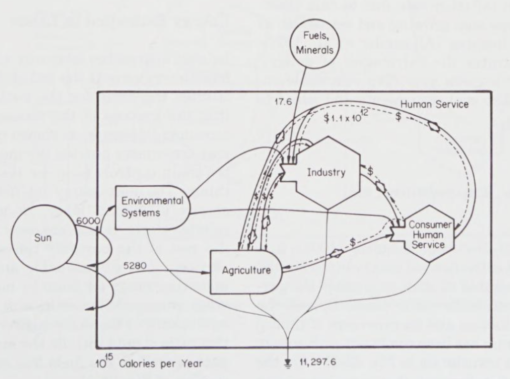
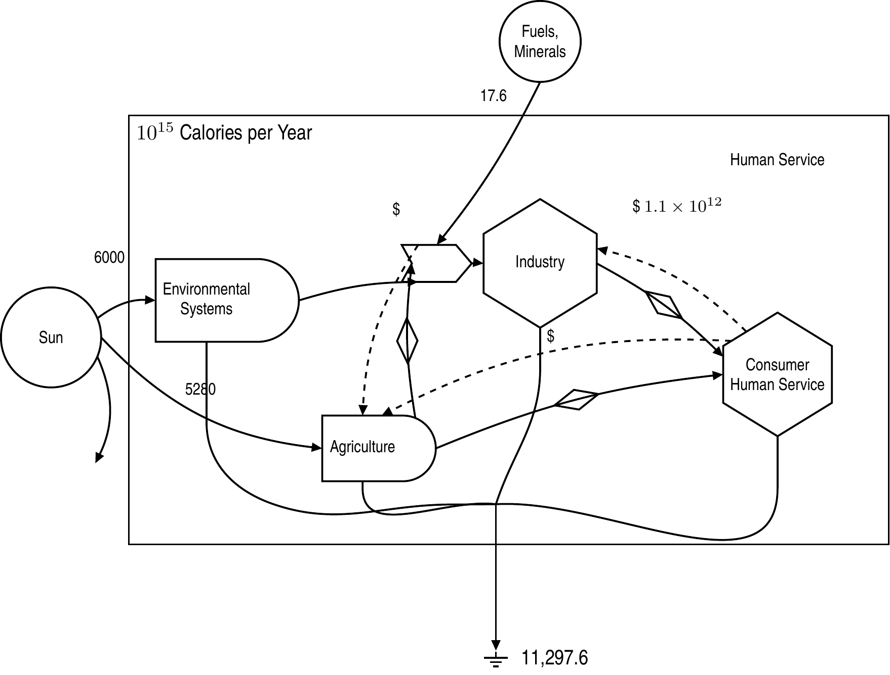
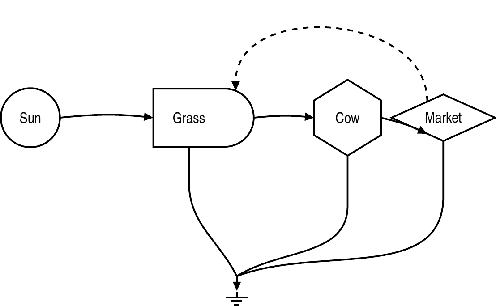

# energese

**H. T. Odum's Energy Systems Language as a LuaLaTeX package.** Describe a system
once, in JSON or in TeX, and the diagram is drawn from it — symbols measured
against Odum's published sheet, components placed by transformity, pathways
routed around whatever they do not connect to.

[](https://doi.org/10.5281/zenodo.22340275)
[](https://github.com/energese-project/latex-energese/actions/workflows/test.yml)
[](LICENSE)
[](https://www.luatex.org/)

| Odum's published figure | Rendered from the model |
| --- | --- |
|  |  |

*The right-hand image is not a screenshot: it is the golden image the test suite
compares against on every build, generated from
[`examples/aggregated-economy.json`](examples/aggregated-economy.json).*

---

## Why

A figure in a paper is usually a drawing kept beside the model it depicts, and
the two drift. Here the diagram is a *function* of the model: change a
transformity or add a pathway and the figure follows, because nothing about the
picture is stored anywhere else. That is what makes a published figure
regenerable, and it is why correctness is measured rather than asserted — the
symbols are checked against Odum's own sheet, not against how they look.

## Install

No installation is needed to try it. Put `energese.sty`, `energese-core.lua`,
`energese-shapes.tex` and `dkjson.lua` on the LaTeX search path — the same
directory as your document will do — and compile with **LuaLaTeX**.

**Requirements**

| | |
| --- | --- |
| Engine | LuaLaTeX (TeX Live 2023 or later) |
| LaTeX packages | TikZ (`positioning`, `arrows.meta`, `shapes.geometric`, `calc`, `backgrounds`), `luacode`, `environ`, `fontspec` |
| Lua | `dkjson` — included in this repository |
| Optional | `poppler-utils` for `pdftoppm`, needed by `make parity` and the fidelity harness |

pdfLaTeX cannot build these documents: the layout engine is a Lua program and
runs through `\directlua`. A `latexmkrc` at the repository root sets the engine
and the search path, so an editor's build button (LaTeX Workshop, TeXShop)
produces the same output as `make`.

## Quick start

```latex
\usepackage{energese}

\begin{energese}
    \esmeta{column_spacing=3.0, row_spacing=1.5}

    \esnode{sun}{source}         {Tr=1,    label={Sun}}
    \esnode{grass}{producer}     {Tr=100,  label={Grass}}
    \esnode{cow}{consumer}       {Tr=2000, label={Cow}}
    \esnode{market}{transaction} {Tr=5000, label={Market}}

    \esflow{sun}{grass}{energy}
    \esflow{grass}{cow}{energy}
    \esflow{cow}{market}{energy}
    \esflow{market}{grass}{money_feedback}
\end{energese}
```



No coordinates: columns come from the transformity values, rows from the
central-spine rule, and the dissipation pathways converge on a single ground
because a producer, a consumer and a transaction all dissipate.

## Authoring

Three paths. The first two share one layout engine and one renderer, so they
produce identical output; the third bypasses both.

### 1. A model in JSON

```latex
\renderEnergese{path/to/diagram.json}     % from a file
```

```latex
\begin{energeseData}                       % or inline
{ "nodes": [ ... ], "edges": [ ... ] }
\end{energeseData}
```

| Object | Keys |
| --- | --- |
| Node | `id`, `type`, `Tr`, `label`, `short_label`, `magnitude`, `x`, `y`, `inside`, `parent`, `label_options` |
| Edge | `from`, `to`, `type`, `label`, `volume`, `options`, `waypoints`, `from_anchor`, `to_anchor` |
| Metadata | `column_spacing`, `row_spacing`, `system_boundary`, `boundary_margin`, `heat_sink_label`, `ground_x`, `label_mode`, `strict` |

Node types are Odum's symbols: `source`, `producer`, `consumer`, `storage`,
`interaction`, `transaction`, `gain`, `loop_limited`, `switch`, plus `text`,
`box` and `ground`. Pathway types are `energy`, `material`, `money_feedback`
and `information`. The [user guide](docs/energese_user_guide.pdf) is the full
reference.

### 2. A model in TeX

The same model as declarative macros — the keys are the JSON field names, so
anything expressible in one is expressible in the other.

| Macro | Purpose |
| --- | --- |
| `\esnode{<id>}{<type>}{<keys>}` | Declare a node |
| `\esflow{<from>}{<to>}{<type>}{<keys>}` | Declare a pathway |
| `\esmeta{<keys>}` | Diagram metadata |
| `\esboundary{<keys>}` | A system boundary; call it more than once for several |

The trailing key list is optional. A value containing a comma must be braced —
`label_options={midway, above}` — and a bare key is a flag, so
`system_boundary` means `system_boundary=true`.

### 3. Raw TikZ

The symbols and pathway styles are ordinary TikZ, for a diagram that wants no
automatic layout:

```latex
\begin{tikzpicture}
    \node[energese source]  (sun) at (0,0) {Sun};
    \node[energese storage] (q)   at (3,0) {$Q$};
    \draw[energese energy] (sun.energy_out) -- (q.energy_in);
\end{tikzpicture}
```

Each symbol carries the named anchors `energy_in`, `energy_out`, `money_in`,
`money_out`, `feedback_in`, `heat_sink` and the compass points, and a ring of
**ports** spaced `\energeseanchorpitch` (3 mm) apart along its outline. The
ports are where pathways attach: a named anchor names a *direction* and resolves
to the port nearest it, and a port holds one pathway, so a second flow arriving
at the same place takes the next port along instead of being drawn over the
first. Models get this automatically; by hand, address a port directly or ask
for one with `\energeseport`.

### Reading a GSSK model

Files from [GSSK](https://github.com/energese-project/GSSK), the simulation kernel
this notation is drawn for, are read directly by `\renderEnergese` — so one file
both simulates and draws, and a published figure comes from the model that
produced the results beside it. See [`docs/gssk-interop.md`](docs/gssk-interop.md).

## Verification

Correctness here is measured, and the measurements are the tests. `make check`
runs all of it.

| Layer | Question it answers | Target |
| --- | --- | --- |
| Unit and compile | Does the layout engine compute the right coordinates, and does every document build? | `make test` |
| Parity | Do the JSON and TeX front ends produce *identical pixels*? | `make parity` |
| Golden regression | Has any symbol or diagram changed, to the pixel? | `make regression` |
| Conformance | Does each symbol match Odum's measured geometry, within a recorded tolerance? | `make conformance` |
| Fonts | Were the fonts the goldens were built with actually embedded? | `make fonts` |

Conformance is the layer worth explaining. Symbol proportions are extracted from
`reference-images/complete-odum-symbols.png` by flood-filling each symbol's
interior, and `tests/fidelity/invariants.json` records the target and its
tolerance. The reference is a 144 DPI capture, so those measurements are good to
roughly 1.5–3% and no better, and the tolerances say so: this is a claim about
proportion, not a claim of pixel-identity with a scan.

```bash
make examples   # build every examples/*.tex
make docs       # build the user guide
make check      # the whole suite: tests, parity, fidelity, docs
```

If `lualatex` is not on `PATH` — running it from a container, say — point the
build at a wrapper: `make check LUALATEX=/path/to/wrapper.sh`.

## Documentation

| | |
| --- | --- |
| [User guide](docs/energese_user_guide.pdf) | Authoring, the model reference, symbols, ports, conventions |
| [AGENTS.md](AGENTS.md) | Architecture, what "pixel-perfect" means here and how it is measured, determinism requirements, the workflow for changing rendered output |
| [docs/gssk-interop.md](docs/gssk-interop.md) | Reading models from the GSSK simulation kernel |
| [docs/article.tex](docs/article.tex) | A paper in preparation on the package and its fidelity method — a draft, not a publication |

## Citing

If this package contributed to work you are publishing, please cite the
archived release:

> Maud, S. (2026). *energese: Odum's Energy Systems Language as a LuaLaTeX
> package* (v0.0.1) [Computer software]. Zenodo.
> https://doi.org/10.5281/zenodo.22340275

```bibtex
@software{maud_energese_2026,
  author    = {Maud, Sholto},
  title     = {energese: Odum's Energy Systems Language as a {LuaLaTeX} package},
  year      = {2026},
  version   = {v0.0.1},
  publisher = {Zenodo},
  doi       = {10.5281/zenodo.22340275},
  url       = {https://github.com/energese-project/latex-energese}
}
```

The DOI above is the **concept DOI**: it always resolves to the most recent
release, which is what to cite unless a particular version is meant. Each
release also has its own DOI — v0.0.1 is
[10.5281/zenodo.22340276](https://doi.org/10.5281/zenodo.22340276).
Machine-readable metadata is in [`CITATION.cff`](CITATION.cff), which GitHub
uses for its *Cite this repository* button.

The notation itself is Odum's, and the work it comes from should be cited
alongside the software:

> Odum, H. T. (1994). *Ecological and General Systems: An Introduction to
> Systems Ecology* (rev. ed.). University Press of Colorado.

## Contributing

[AGENTS.md](AGENTS.md) is the source of truth for how this repository works, and
is worth reading before a first change — particularly §2 on what fidelity means
here, §3 on the determinism the golden images depend on, and §5 on the workflow
for changing rendered output. Two rules catch most newcomers:

- **A green build is not a correct diagram.** Every example compiled cleanly
  while two symbols were the wrong shape entirely. Look at the render.
- **Goldens are never hand-edited or regenerated to make a failure go away.**
  Review the diff, then `make regression-accept`.

## License

MIT — see [LICENSE](LICENSE). The symbol geometry is derived from measurements
of Odum's published work, which is cited above and not redistributed here beyond
the reference images used for testing.
